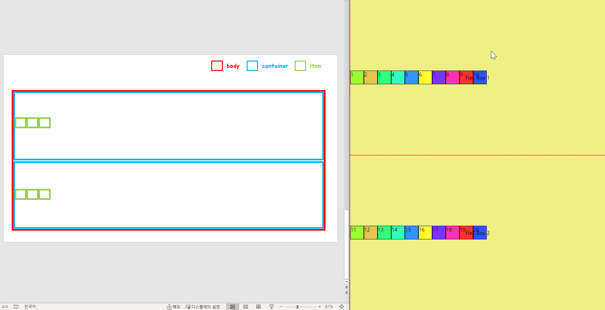
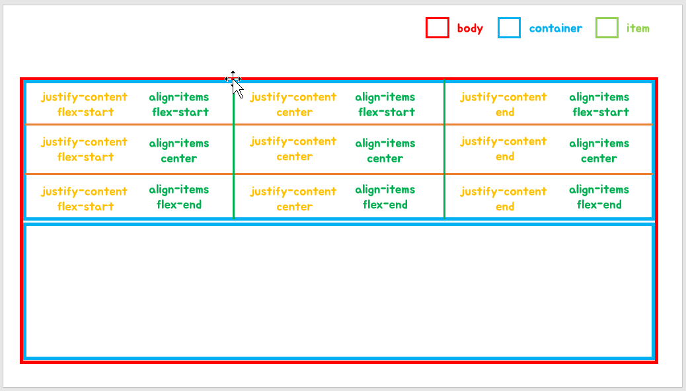

# Flex Layout
- Container
    - [ ] display
    - [ ] justify-content
    - [ ] align-items
    - [ ] flex-wrap
    - [ ] flex-direction
    - [ ] flex-flow (flex-wrap + flex-direction)
    - [ ] align-content (default stretch)
    
    
- Item
    - [ ] flex-grow
    - [ ] order
    - [ ] flex-shrink
    - [ ] align-self

<br>

## 📌 Container

#### `default`


```css
.container {
    
}
.item {
    
}
```

<br>

<details>
<summary>더보기</summary>
<div markdown="1">

```html
<!DOCTYPE html>
<html lang="en">
<head>
    <meta charset="UTF-8">
    <title>플렉스 레이아웃</title>
    <style>
        body {
            margin: 0;
        }
        .t1 {
            position: absolute;
            top: 50%;
            left: 50%;
            transform: translate(-50%, -50%);
        }
        .t1:after {
            content: attr(data-value);
        }
        .t2 {
            position: absolute;
            top: 50%;
            left: 50%;
            transform: translate(-50%, -50%);
        }
        .t2:after {
            content: attr(data-value);
        }
        .containerWrap {
            position: relative;
            display: block;
        }
        .container {
            border: 1px red dashed;
            height: 50vh;
            background: #eeef85;
            box-sizing: border-box;
        }
        .item {
            width: 40px;
            height: 40px;
            border: 1px solid;
        }
        .item1, .item11 {
            background: #9bff31;
        }
        .item2, .item12 {
            background: #e8c453;
        }
        .item3, .item13{
            background: #31ff7d;
        }
        .item4, .item14 {
            background: #31ffbe;
        }
        .item5, .item15{
            background: #3195ff;
        }
        .item6, .item16 {
            background: #fffc31;
        }
        .item7, .item17{
            background: #8031ff;
        }
        .item8, .item18{
            background: #ff31b3;
        }
        .item9, .item19 {
            background: #ff3131;
        }
        .item10, .item20 {
            background: #3153ff;
        }
    </style>
</head>
<body>
<div class="parent">
    <div class="t1" data-value="Flex Box 1"></div>
    <div class="container">
        <div class="item item1">1</div>
        <div class="item item2">2</div>
        <div class="item item3">3</div>
        <div class="item item4">4</div>
        <div class="item item5">5</div>
        <div class="item item6">6</div>
        <div class="item item7">7</div>
        <div class="item item8">8</div>
        <div class="item item9">9</div>
        <div class="item item10">10</div>
    </div>
</div>
<div class="parent">
    <div class="t2" data-value="Flex Box 2"></div>
    <div class="container">
        <div class="item item11">11</div>
        <div class="item item12">12</div>
        <div class="item item13">13</div>
        <div class="item item14">14</div>
        <div class="item item15">15</div>
        <div class="item item16">16</div>
        <div class="item item17">17</div>
        <div class="item item18">18</div>
        <div class="item item19">19</div>
        <div class="item item20">20</div>
    </div>
</div>
</body>
</html>
```
    
</div>
</details> 

<br>

#### `flex`


```css
.container { 
    display: flex;
}
```

<br>

### `justify-cotent`
- flex-start 


```css
.container { 
    display: flex;
    justify-content: flex-start;
}
```

<br>

- center


```css
.container { 
    display: flex;
    justify-content: center;
}
```

<br>

- flex-end


```css
.container { 
    display: flex;
    justify-content: flex-end;
}
```

<br>

- space-evenly


```css
.container { 
    display: flex;
    justify-content: space-evenly;
}
```

<br>

- space-around


```css
.container { 
    display: flex;
    justify-content: space-around;
}
```

<br>

- space-between


```css
.container { 
    display: flex;
    justify-content: space-between;
}
```

<br>

### `align-items`


<br>

- flex-start


```css
.container { 
    display: flex;
    align-items: flex-start;
}
```

<br>

- center



```css
.container { 
    display: flex;
    align-items: center;
}
```

<br>

- flex-end


```css
.container { 
    display: flex;
    align-items: flex-end;
}
```

<br>

- baseline


```css
.container { 
    display: flex;
    align-items: baseline;
}
.item1 {
    width: 100px;
    height: 100px;
    line-height: 100px;
    text-align: center;
}
```

<br>

- stretch (default)


```css
.container { 
    display: flex;
    align-items: stretch;
}
.item {
    /*height: 40px;*/
    width: 40px;
    border: 1px solid;
}
```

<br>

### `justify-content` & `align-items`
 


<br>

### `flex-wrap`
⚠ item 들이 container 의 넓이를 벗어나는 경우

<br>


<br>

- nowrap (default)


```css
.container { 
    display: flex;
    flex-wrap: nowrap;
}
```

<br>

- wrap


```css
.container { 
    display: flex;
    flex-wrap: wrap;
}
```

<br>

- wrap-reverse


```css
.container { 
    display: flex;
    flex-wrap: wrap-reverse;
}
```

<br>

### `flex-direction`

- row (default)


```css
.container { 
    display: flex;
    flex-direction: row;
}
```

<br>

- row-reverse


```css
.container { 
    display: flex;
    flex-direction: row-reverse;
}
```

<br>

- column


```css
.container { 
    display: flex;
    flex-direction: column;
}
```

<br>

- column-reverse


```css
.container { 
    display: flex;
    flex-direction: column-reverse;
}
```

<br>

### `flex-direction: column & justify-content`

- column
- flex-start


 
 ```css
 .container { 
     display: flex;
     flex-direction: column;
     justify-content: flex-start;
 }
 ```

<br>

- column
- center


 
 ```css
 .container { 
     display: flex;
     flex-direction: column;
     justify-content: center;
 }
 ```

<br>

- column
- flex-end


 
 ```css
 .container { 
     display: flex;
     flex-direction: column;
     justify-content: flex-end;
 }
 ```

<br>

- column
- space-evenly


 
 ```css
 .container { 
     display: flex;
     flex-direction: column;
     justify-content: space-evenly;
 }
 ```

<br>

- column
- space-evenly


 
 ```css
 .container { 
     display: flex;
     flex-direction: column;
     justify-content: space-around;
 }
 ```

<br>

- column
- space-between


 
 ```css
 .container { 
     display: flex;
     flex-direction: column;
     justify-content: space-between;
 }
 ```

<br>

### `flex-direction: column & align-items`

- column
- flex-start


 
 ```css
 .container { 
     display: flex;
     flex-direction: column;
     align-items: flex-start;
 }
 ```

<br>

- column
- center


 
 ```css
 .container { 
     display: flex;
     flex-direction: column;
     align-items: center;
 }
 ```

<br>

- column
- flex-end


 
 ```css
 .container { 
     display: flex;
     flex-direction: column;
     align-items: flex-end;
 }
 ```

<br>

### `flex-direction: column & align-items & justify-content`




<br>

### align-content

- stretch (default)


```css
.container {
    display: flex;
    flex-wrap: wrap;
    align-content: stretch;
}

.item {
    width: 100%;
}
```

<br>

- flex-start


```css
.container {
    display: flex;
    flex-wrap: wrap;
    align-content: flex-start;
}

.item {
    width: 100%;
}
```

<br>

- center


```css
.container {
    display: flex;
    flex-wrap: wrap;
    align-content: center;
}

.item {
    width: 100%;
}
```

<br>

- flex-end


```css
.container {
    display: flex;
    flex-wrap: wrap;
    align-content: flex-end;
}

.item {
    width: 100%;
}
```

<br>

- space-evenly


```css
.container {
    display: flex;
    flex-wrap: wrap;
    align-content: space-evenly;
}

.item {
    width: 100%;
}
```

<br>

- space-around


```css
.container {
    display: flex;
    flex-wrap: wrap;
    align-content: space-around;
}

.item {
    width: 100%;
}
```

<br>

- space-between


```css
.container {
    display: flex;
    flex-wrap: wrap;
    align-content: space-between;
}

.item {
    width: 100%;
}
```

<br>

### inline-flex

- containerWrap : block
- container : inline-flex


 ```css
.containerWrap {
    display: block;
}

 .container { 
     display: flex;
     flex-direction: column;
     align-items: flex-end;
 }
 ```

<br>

- containerWrap : inline-block
- container : inline-flex


 ```css
.containerWrap {
    display: inline-block;
}

 .container { 
     display: flex;
     flex-direction: column;
     align-items: flex-end;
 }
 ```

<br>

- 💥 container n개 의 넓이의 합이 containerWrap 의 넓이 보다 큰 경우 자동으로 block 처리 된다
- 💥 만약 container 1개의 넓이가 containerWrap 넓이보다 큰 경우 가로 스크롤이 생긴다 
- containerWrap : inline-block 
- container : inline-flex


<br>


 ```css
.containerWrap {
    display: inline-block;
}

 .container { 
     display: flex;
     flex-direction: column;
     align-items: flex-end;
 }
 ```

<details>
<summary>더보기</summary>
<div markdown="1">

```html
<!DOCTYPE html>
<html lang="en">
<head>
    <meta charset="UTF-8">
    <title>플렉스 레이아웃</title>
</head>
<style>
    body {
        margin: 0;
    }
    .t1 {
        position: absolute;
        top: 50%;
        left: 50%;
        transform: translate(-50%, -50%);
    }
    .t1:after {
        content: attr(data-value);
    }
    .t2 {
        position: absolute;
        top: 50%;
        left: 50%;
        transform: translate(-50%, -50%);
    }

    .t2:after {
        content: attr(data-value);
    }
    .containerWrap {
        position: relative;
        display: inline-block;
    }
    .container {
        border: 1px red dashed;
        height: 50vh;
        background: #eeef85;
        box-sizing: border-box;
        display: inline-flex;
    }

    .item {
        width: 40px;
        height: 40px;
        border: 1px solid;
    }
    .item1, .item11 {
        background: #9bff31;
    }
    .item2, .item12 {
        background: #e8c453;
    }
    .item3, .item13{
        background: #31ff7d;
    }
    .item4, .item14 {
        background: #31ffbe;
    }
    .item5, .item15{
        background: #3195ff;
    }
    .item6, .item16 {
        background: #fffc31;
    }
    .item7, .item17{
        background: #8031ff;
    }
    .item8, .item18{
        background: #ff31b3;
    }
    .item9, .item19 {
        background: #ff3131;
    }
    .item10, .item20 {
        background: #3153ff;
    }
</style>
<body>
<div class="containerWrap">
    <div class="t1" data-value="Flex Box 1"></div>
    <div class="container">
        <div class="item item1">1</div>
        <div class="item item2">2</div>
        <div class="item item3">3</div>
        <div class="item item4">4</div>
<!--        <div class="item item5">5</div>-->
<!--        <div class="item item6">6</div>-->
<!--        <div class="item item7">7</div>-->
<!--        <div class="item item8">8</div>-->
<!--        <div class="item item9">9</div>-->
<!--        <div class="item item10">10</div>-->
    </div>
</div>
<div class="containerWrap">
    <div class="t2" data-value="Flex Box 2"></div>
    <div class="container">
        <div class="item item11">11</div>
        <div class="item item12">12</div>
        <div class="item item13">13</div>
        <div class="item item14">14</div>
        <div class="item item15">15</div>
        <div class="item item16">16</div>
        <div class="item item17">17</div>
        <div class="item item18">18</div>
        <div class="item item19">19</div>
        <div class="item item20">20</div>
    </div>

</div>
</body>
</html>

```
    
</div>
</details> 


<br>

## 📌 Item

- flex-grow = flex


 ```css
 .item { 
     flex-grow: 1;
 }
 ```

<br>


 ```css
 .item1 { 
     flex-grow: 1;
 }
 ```

<br>


 ```css
 .item1, .item10 { 
     flex-grow: 1;
 }
 ```

<br>

### `container - flex-wrap: wrap & item - flex-grow: 1`


 ```css
 .item { 
    width: 40px;
    flex-grow: 1;
 }
 ```
<br>


```css
.item { 
    width: 80px;
    flex-grow: 1;
}
```

<br>


```css
.item { 
    width: 750px;
    flex-grow: 1;
}
```

<br>

### `order`

- order: 0 (default)


```css
.item1 {
    order: 0 
}
```

<br>

- order: 1


```css
.item1 {
    order: 1 
}
```

<br>

- order: 1
- order: -1


```css
.item1 {
    order: 1 
}
.item3 {
    order: -1 
}
```

<br>

### `flex-shrink`

- flex-shrink: 1 (default)


```css
.item5 {
    flex-shrink: 1;
}
```

<br>

- flex-shrink: 0


```css
.item5 {
    flex-shrink: 10;
}
```

<br>

- flex-shrink: 10


```css
.item5 {
    flex-shrink: 0;
}
```

<br>

### `align-self`

- flex-start (default)


```css
.item2 {
    align-self: flex-start;
}
```

<br>

- center


```css
.item2 {
    align-self: center;
}
```

<br>

- flex-end


```css
.item2 {
    align-self: flex-end;
}
```

<br>

- baseline


```css
.container {
    display: flex;
    align-items: stretch;
}

.item {
    line-height: 25vw;
}

.item2 {
    align-self: baseline;
}
```