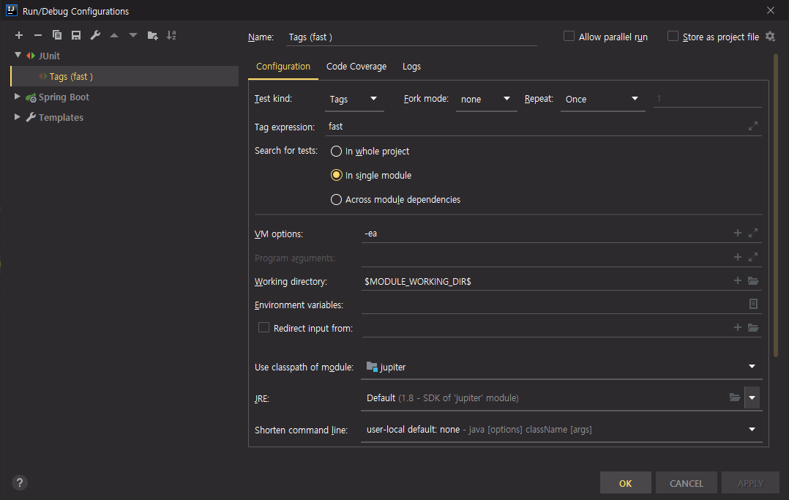

# JUnit 5 Jupiter

- 자바 리플렉션 기반으로 되어있다.
- 접근자를 사용하지 않아도 된다

<br>

## 📌 테스트 기본 어노테이션

###`@Test`

- JUnit 테스트를 하기위한 어노테이션

<br>

###`@BeforeAll` <-> `@AfterAll`

- 가장 처음에 실행되는 어노테이션
- static 메소드로 작성되어 있어야 한다
- 1번만 실행된다   
  
<br>

###`@AfterAll` <-> `@BeforeAll`

- 가장 마지막에 실행되는 어노테이션
- static 메소드로 작성되어 있어야 한다
- 1번만 실행된다

<br>

###`@BeforeEach` <-> `@AfterEach`

- @Test 코드 실행 전 마다 실행되는 어노테이션

<br>

###`@AfterEach` <-> `@BeforeEach`

- @Test 코드 실행 후 마다 실행되는 어노테이션

<br>

## 📌 Display Name

### `@DisplayNameGeneration(DisplayNameGenerator.ReplaceUnderscores.class)`

- _(언더스코어) 를 ' ' 로 변환 해주는 어노테이션

```java
@DisplayNameGeneration(DisplayNameGenerator.ReplaceUnderscores.class)
class Tests {
    
    @Test
    void create_account_service() {}
}
```

- 실행 시 `create_account_service` 가 아닌 `create account service` 로 테스트명이 나온다

<br>

### `@DisplayName("테스트명")`

- 원하는 명칭으로 바꿀 수 있다. (공백, 한글, 이모지 지원)

```java
class Tests {
    @Test
    @DisplayName("한글과 이모지 사용 가능 o((>ω< ))o")
    void create() {}
}
```

<br>

## 📌 Assertion

|Junit 기본 static Method|내용|
|---|---|
|assertEquals|같다 비교|
|assertNotNull|Null 이 아니다|
|assertAll|assert*** 한번에 출력|
|assertThrow|에러 검사|
|assertTimeout|시간 내에 살행되는 지 검사|

<br>

```java
class Tests {
    @Test
    void create() {
        String nameA = "martin";
        String nameB = "denny";
        int ageA = 10;
        
        assertAll(
            () -> assertNotNull(nameA),
            () -> assertEquals("martin", nameA, () -> "메시지"),
            () -> assertTrue(ageA > 0 , "메시지")
        );
    }
}
```
- assertAll 을 이용하여 한번에 3개의 결과를 알아 낼 수 있다

<br>

```java
class Study {
    public Study(int limit){
        if (limit < 0) throw new IllegalArgumentException("0보다 커야 한다");
    } 
}

class Tests {
    @Test
    void create() {
        
        IllegalArgumentException exception = assertThrows(IllegalArgumentException.class, () -> new Study(-10));
       
        String message = exception.getMessage();
               
        assertEquals(message, "0보다 커야 된다");
    }
}
```

<br>

```java
class Study {
    public Study(int limit){
        if (limit < 0) throw new IllegalArgumentException("0보다 커야 한다");
    } 
}
class Tests {
    @Test
    void create() {
        assertTimeout(Duration.ofMillis(100), () -> {
            new Study(10);
            Thread.sleep(300);
        });
    }
}
```
- 테스트 종료 시간 100 millisecond 보다 큰 경우 테스트 실패 처리한다
- 테스트 코드가 늦게 끝날 수록 해당 테스트 코드도 늦게 끝난다
- 안전성은 좋다

<br>

```java
class Study {
    public Study(int limit){
        if (limit < 0) throw new IllegalArgumentException("0보다 커야 한다");
    } 
}
class Tests {
    @Test
    void create() {
        assertTimeoutPreemptively(Duration.ofMillis(100), () -> {
            new Study(10);
            Thread.sleep(300);
        });
    }
}
```

- 이 방식은 100 millisecond 가 지나면 테스트를 종료하는 방식이다 (timeout 과 달리 기다리지 않아도 됨)
- ThreadLocal 을 이용하기 때문에 트랜잭션에 관한 처리에 대해 주의가 필요하다
- ThreadLocal 로 인해 트랜잭션이 관여하지 못한다면, 해당 쿼리문에 대해 rollback 처리를 못할 수 있다 (주의 필요)


## 📌 조건에 따라 JUnit 실행 특정 OS , 특정 환경 변수

### `@EnabledOnOs({OS.MAC, OS.LINUX, OS.WINDOWS})`
- 해당 OS 환경에서만 실행 가능

<br>

### `@DisabledOnOs({OS.MAC, OS.LINUX, OS.WINDOWS})`
- 해당 OS 환경에서는 실행 못함

<br>

### `@EnabledOnJre({JRE.JAVA_8, JRE.JAVA_9, JRE.JAVA_17})`
- 해당 JRE 버전만 실행 가능

<br>

### `@DisabledOnJre({JRE.JAVA_8, JRE.JAVA_9, JRE.JAVA_17})`
- 해당 JRE 버전은 실행 못함

<br>

### `assumeTrue()`
- 해당 조건을 만족하지 못하는 경우 TEST 중지
- `System.getenv("환경변수명")`
- 인텔리제이는 실행 될 때 환경변수를 불러오기 때문에 환경변수를 추가하더라도 인텔리제이를 껐다켜야 적용이 된다

```java
class Tests {
    @Test
    void create() {
        String username = System.getenv("USERNAME");
        System.out.println(username);
        assumeTrue("SYSTEM".equals(username));
        
        System.out.println("틀린 경우 실행 안됨");   
    }
}
```

<br>

### `assumingThat()`

```java
class Tests {
    @Test
    void create() {
        String username = System.getenv("USERNAME");
        System.out.println(username);
        
        assumingThat("keesun".equalsIgnoreCase(username), () -> {
                    System.out.println("keesun");
                    Study actual = new Study(10);
                    assertThat(actual.getLimit()).isGreaterThan(0);
        });   
    }
}
```

<br>

### `@EnabledIfEnvironmentVariable(named = "USERNAME", matches = "SYSTEM")`
- 해당 환경변수에서만 실행

```java
class Tests {
    @Test
    @EnabledIfEnvironmentVariable(named = "USERNAME", matches = "SYSTEM")
    void create() {
    }
}
```

<br>

## 📌 JUnit 테스트 태깅과 필터링
- 인텔리제이에서는 태그를 이용하여 필터링을 걸려면 아래와 같이 설정을 해주어야 한다 



<br>

```java
class Tests {

    @Test
    @Tag("fast")
    void create() {
        System.out.println("fast tag test");
    }   

    @Test
    @Tag("slow")
    void update() {
        System.out.println("slow tag test");
    }   
}
```

- 위와 같은 코드를 전체실행하면 fast 만 실행 된다
- 하지만 위와 같은 설정 방법은 인텔리제이 환경에서만 적용되기 때문에 빌드시에는 @Tag 어노테이션을 무시할 수 있다
- 메이븐에서는 profile 을 이용해 원하는 빌드 또는 테스트를 할 수 있다
- 로컬환경에서 오래걸리는 테스트라, 테스트하기 부담스러울 때는 CI 환경에서 테스트 할 수 있도록하는 것이 좋다

<br>

### `mvnw test -P {profile id명}`

```mxml
<profiles>
    <profile>
        <id>default</id>
        <activation>
            <activeByDefault>true</activeByDefault>
        </activation>
        <build>
            <plugins>
                <plugin>
                    <artifactId>maven-surefire-plugin</artifactId>
                    <configuration>
                        <groups>fast</groups>
                    </configuration>
                </plugin>
            </plugins>
        </build>
    </profile>
    <profile>
        <id>ci</id>
        <activation>
            <activeByDefault>true</activeByDefault>
        </activation>
        <build>
            <plugins>
                <plugin>
                    <artifactId>maven-surefire-plugin</artifactId>
                    <configuration>
                        <groups>fast | slow</groups> <!-- or 연산자도 가능하다 -->
                    </configuration>
                </plugin>
            </plugins>
        </build>
    </profile>
</profiles>
```

- `mvnw test -P default` 를 실행한다면 1개의 테스트만 실행될 것이고,
- `mvnw test -P ci` 를 실행한다면 2개의 테스트를 실행할 것이다

<br>

## 📌 JUnit 커스텀 태그 (메타 어노테이션 사용하기)
- src/test 패키지에 커스텀 어노테이션 생성하기
- 아래코드는 `@Test + @Tag("fast")` 를 합친 `@FastTest` 커스텀 어노테이션이다

```java
@Target(ElementType.METHOD) 
@Retention(RetentionPolicy.RUNTIME)
@Test
@Tag("fast")
public @interface FastTest {
}
```

```java
class Tests {
    @FastTest
    void create() { 
        System.out.println("fast tag test");
    }
}
```